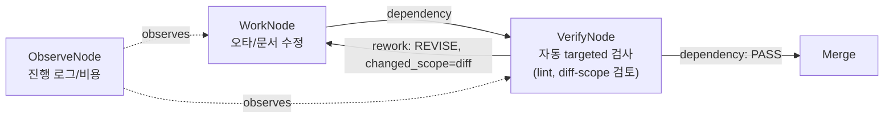
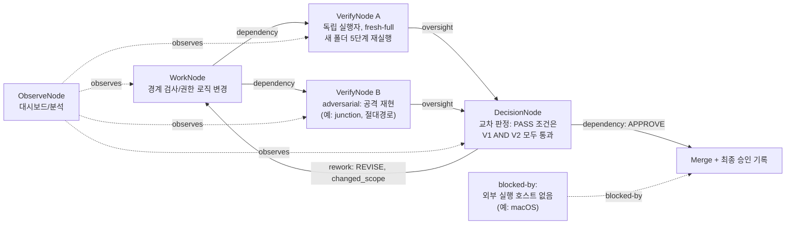

# 대안 설계: 조직도가 아니라 위험도에서 태어나는 그래프

작성일: 2026-08-09 (Asia/Seoul)
작성자: 독립 설계 초안 (Claude) — 다른 설계자의 초안을 보지 않고 작성했습니다.
성격: **설계 전용 문서입니다. 코드를 한 줄도 구현하지 않았습니다.**
입력 자료: `docs/research/TEAM_GRAPH_ANALYSIS.md`, `docs/research/PORTABILITY_AND_DEPENDENCY.md`, `docs/research/LIVE_GAME_DASHBOARD.md` (세 조사 보고서 전체를 읽고 종합했습니다.)

---

## 0. 한눈에 보는 결론

Doctori가 겪는 네 가지 문제 — **고정 팀**, **직렬 검증**, **거짓 progress**, **느린 재작업** — 는
사실 하나의 원인에서 나옵니다. **"누가 일하는가"와 "무엇을 얼마나 확인해야 하는가"가
영구적인 조직도 한 장에 같이 박혀 있다는 것**입니다. 설계 1팀·설계 2팀·검증 1팀·검증 2팀이라는
이름은 매번 똑같은 절차(5단계 새 폴더 재실행)를 강제하고, 작은 문서 수정과 junction 공격 같은
보안 결함을 같은 무게로 다룹니다. 그 결과 안전한 검증은 유지되지만 값싼 작업까지 비싸지고,
"검증 중"이라는 말이 실제로 무엇을 확인하고 있는지 알 수 없게 됩니다.

이 문서가 제안하는 대안은 다음 한 문장으로 요약됩니다.

> **역할 이름이 그래프를 만드는 것이 아니라, 위험도가 그래프를 만든다.**
> 작업이 시작될 때마다 "이 작업의 위험 등급이 무엇인가"를 먼저 계산하고, 그 결과에 따라
> 필요한 노드(작업/검증/관찰/결정)와 엣지(의존/감시/재작업/차단/관찰)를 그 자리에서
> 조립합니다. 사람이나 에이전트는 고정된 방 번호가 아니라 "이 노드가 요구하는 능력과
> 독립성 조건"에 맞춰 그때그때 배정됩니다. 이 그래프 엔진은 파일 하나(append-only 이벤트
> 로그)와 평범한 프로세스 실행만으로 동작하므로, Orca 없이 아무 터미널에서나 돌아갑니다.
> Orca는 이 이벤트 로그를 예쁘게 보여주고 편의 기능을 더하는 **거울(adapter)**일 뿐,
> 그래프 엔진의 주인이 아닙니다.

---

## 1. 12살도 이해하는 설명

### 1.1 미션 보드 이야기

학교에 미션 보드가 있다고 상상해보세요. 누가 어떤 미션을 맡았는지, 언제 끝났는지,
선생님이 확인했는지를 모두 적어두는 큰 종이 게시판입니다.

지금 Doctori는 이렇게 되어 있어요. 미션이 크든 작든 상관없이 **정해진 순서로 정해진
일곱 개의 방**을 전부 거쳐야 해요. 기획실 → 조사실 → 설계1실 → 설계2실 → 구현실 →
검사1실 → 검사2실. 문 하나를 지날 때마다 도장을 받아야 다음 문을 열 수 있어요.
문제가 생기면 다시 앞방으로 돌아가서 새로 시작해야 하고요.

그런데 잘 생각해보면, 미션에는 두 가지 종류가 있어요.

- **작은 미션**: "게시판 글씨 오타 고치기". 한 명이 고치고, 선생님이 한 번 쓱 보면 끝나요.
- **위험한 미션**: "학교 정문 자물쇠 비밀번호를 바꾸는 미션". 한 명이 실수하면 도둑이
  들어올 수 있어요. 이런 미션은 **서로 다른 두 명이 각자 따로** 자물쇠를 흔들어보고,
  둘 다 "안전해요"라고 해야 통과시켜야 해요.

지금 Doctori는 오타 고치기도, 자물쇠 바꾸기도 **똑같이 일곱 개 방을 다 거치게** 만들어요.
그래서 오타 고치는 데도 하루가 걸리고, 다들 "이렇게까지 해야 하나?"라고 느끼게 돼요.
이 설계는 이 문제를 **"미션마다 위험도를 먼저 재고, 그 위험도에 맞는 모양의 보드를
그때그때 새로 그리자"**로 풉니다.

### 1.2 미션 카드 네 가지 색깔

새 보드에는 미션 카드가 딱 네 가지 색깔만 있어요.

| 카드 색깔 | 뜻 | 예시 |
| --- | --- | --- |
| 🟦 **작업 카드** | 진짜로 무언가를 만드는 사람 | 코드를 고치는 사람, 문서를 쓰는 사람 |
| 🟩 **검사 카드** | 작업 카드를 만든 사람과는 **다른 사람**이 확인 | "이 코드 진짜 안전해?"를 확인하는 사람 |
| ⬜ **구경 카드** | 그냥 지켜보기만 하고, 통과·불통과를 결정할 힘이 없음 | 대시보드, 비용 계산, 진행 상황 요약 |
| 🟥 **결정 카드** | 사람(또는 정해진 책임자)이 직접 답해야만 다음으로 넘어감 | "이 위험한 변경을 승인할까요?" |

일곱 개의 영구적인 "방 이름"은 사라져요. 대신 미션이 시작될 때마다 딱 필요한 만큼의
카드가 새로 놓여요. 오타 고치기 미션은 🟦 카드 하나 + 🟩 카드 하나로 끝나요.
자물쇠 바꾸기 미션은 🟦 카드 하나 + 🟩 카드 **두 개(서로 다른 사람!)** + 🟥 카드
하나가 놓여요.

### 1.3 세 개의 다른 불빛 — "숨쉬고 있다"와 "일하고 있다"는 다른 말

Doctori의 대시보드가 70%에서 멈춰 보인 이유는, "아직 살아있다"는 신호와
"실제로 진전이 있었다"는 신호를 한 개의 초록 불빛으로 뭉뚱그려 보여줬기 때문이에요.
이건 마치 친구가 전화를 안 끊었다고 해서 계속 말하고 있는 건 아닌 것과 같아요.
숨소리(살아있음)와 말소리(진전)는 달라요.

그래서 이 설계는 미션 카드마다 불빛을 **세 개**로 나눠요.

1. **숨쉬기 불빛(생존)**: "아직 죽지 않았어요"라는 신호. 30초~1분마다 깜빡여요.
2. **걸음 불빛(진행)**: "실제로 한 걸음 나아갔어요"라는 신호. 진짜 일이 있을 때만 켜져요.
3. **도장 불빛(판정)**: 검사 카드가 "통과" 또는 "다시 해와"를 찍었을 때만 켜져요.

숨쉬기 불빛만 계속 깜빡인다고 걸음 불빛이 저절로 켜지면 안 돼요. 그게 바로
"거짓 progress"예요. 진짜 걸음이 없으면 숫자는 그대로 멈춰 있어야 하고, 화면에는
"살아있음, 새 진전 없음(48초째)"처럼 정직하게 써줘야 해요.

### 1.4 클럽하우스(Orca) 없이도 되는 이유

Orca는 멋진 클럽하우스예요. 안에 들어가면 큰 화면, 자동 브라우저, 예쁜 사이드바가
다 있어요. 그런데 미션 보드 자체는 **공책 한 권**만 있으면 돌아가요. 무슨 일이
있었는지 한 줄씩 적어나가는 공책이에요. 클럽하우스 안에 있을 때는 그 공책 내용을
그대로 베껴서 클럽하우스 벽에도 예쁘게 붙여주는 로봇 비서가 있을 뿐이에요.
클럽하우스가 문을 닫아도(=Orca가 꺼져도) 공책은 책상 위에 그대로 남아있고, 누구든
그 공책만 보면 무슨 일이 있었는지 다시 알 수 있어요. 그래서 이 설계에서 **Orca는
"있으면 좋은 장식"**이지, 미션 보드가 존재하기 위한 필수 조건이 아니에요.

---

## 2. 설계 후보 — 핵심 그래프 엔진

### 2.1 문제를 그래프 언어로 다시 쓰기

세 조사 보고서를 그래프 관점에서 겹쳐보면 다음 대응 관계가 드러납니다.

| Doctori의 문제 | 그래프 언어로 표현한 원인 | 이 설계의 대응 |
| --- | --- | --- |
| 고정 팀 | Role(영구 이름)이 Node(실행 인스턴스)와 1:1로 결합됨 | Node는 **capability + independence 제약**만 선언. Role은 그 제약을 만족하는 실행자 후보 풀일 뿐 |
| 직렬 검증 | 모든 작업이 동일한 `verification_depth`(항상 fresh-full 5단계)를 강제로 통과 | `risk_class`가 `verification_depth`(none/targeted/fresh-full)와 fan-out 수를 결정 |
| 거짓 progress | liveness(생존)·progress(진행)·verdict(판정) 세 신호가 하나의 상태값으로 뭉개짐 | 세 신호를 노드 상태의 **분리된 필드**로 강제. progress는 근거(basis)가 있는 이벤트에서만 갱신 |
| 느린 재작업 | rework가 항상 "처음부터 새 폴더에서 5단계 전체 재실행" | rework edge가 `changed_scope`를 계산해 **영향받은 부분만** 재검증. 단, 위험도가 오르면 fresh-full로 승격 |

### 2.2 노드 네 가지: 작업 / 검증 / 관찰 / 결정

그래프의 모든 실행 단위는 이 네 가지 노드 타입 중 하나입니다. (역할 이름이 아니라
**행동의 성격**으로 분류합니다.)

- **WorkNode (작업 노드)**: 실제로 산출물을 만들거나 바꿉니다. 코드, 문서, 설계안 등.
  자신의 진행 상태를 `progressed` 이벤트로만 보고합니다.
- **VerifyNode (검증 노드)**: WorkNode의 산출물을 독립적으로 확인합니다. **작성자와
  동일한 실행자(같은 사람/같은 모델/같은 context)일 수 없다**는 제약이 반드시 걸립니다.
  `verification_depth` 속성(아래 2.4)을 가지고, 통과/재작업 판정(`verdict`)만 만들 수
  있습니다.
- **ObserveNode (관찰 노드)**: 읽기 전용입니다. 대시보드, 비용 분석, 진행 로그 요약,
  하트비트 워치독이 여기 속합니다. **다음 노드를 막을 권한이 없습니다.** 관찰 노드가
  게이트 역할을 하게 되는 순간, 그 관찰 노드는 실제로는 검증 노드이므로 재분류해야
  합니다.
- **DecisionNode (결정 노드)**: 정해진 권한을 가진 사람 또는 역할만 응답할 수 있는
  멈춤 지점입니다. 질문, 근거(evidence_refs), 선택지, 만료 조건을 가져야 하며, 응답
  전까지 하위 엣지는 실행되지 않습니다.

이 네 가지만으로 F01의 R-P(기획), R-I(조사), R-D1/D2(설계), R-V1/V2(검증), R-A(분석)를
모두 표현할 수 있습니다. R-P는 대부분 DecisionNode(배정 결정)와 ObserveNode(상태 통합)의
혼합이었고, R-A는 순수 ObserveNode였습니다. 역할 이름이 사라져도 F01이 실제로 했던
행동은 그대로 표현됩니다.

### 2.3 엣지 다섯 가지

| edge_type | 뜻 | 규칙 |
| --- | --- | --- |
| `dependency` | 뒤 노드는 앞 노드가 끝나야 시작 | 일반적인 순서 제약. DAG 부분을 구성 |
| `oversight` | 독립적인 VerifyNode가 같은 산출물을 확인 | from/to의 실행자 identity가 달라야 함(스케줄러가 강제) |
| `rework` | 판정이 REVISE일 때 WorkNode로 되돌아감 | 반드시 `changed_scope`와 `rework_of`를 채워야 함 |
| `blocked-by` | 외부 자원(예: macOS 실행 호스트)이 없어 멈춤 | "실패"와 구분되는 상태. 재시도 가능 시점을 기록 |
| `observes` | ObserveNode가 이벤트를 읽음 | 게이트 권한 없음. 삭제해도 그래프의 실행 결과는 변하지 않아야 함(관찰은 부작용이 없어야 한다는 불변식) |

`decision-gate`를 별도 edge type으로 만들지 않고 `dependency`의 특수 형태로 둡니다.
다만 DecisionNode로 들어가는 `dependency` 엣지는 자동으로 실행자 제약이 "지정된
결정 권한을 가진 자"로 고정됩니다.

### 2.4 위험도가 그래프 모양을 결정한다 (risk classifier)

작업이 그래프에 들어오기 전에, 변경된 경로(changed paths)와 작업 설명을 보고
**risk_class**를 계산합니다. 이 계산 자체는 그래프 밖에서 일어나는 규칙 함수입니다
(사람이 태그를 붙이거나, 경로 패턴 규칙으로 자동 분류하거나, 둘의 조합).

| risk_class | 예시 | fan-out(VerifyNode 수) | verification_depth | 사람 결정 필요? |
| --- | --- | --- | --- | --- |
| `docs-only` | 오타, 문서 정리, 링크 수정 | 0 (자동 lint만) | `none` | 아니오 |
| `low-risk-change` | 내부 리팩터, UI 문구 | 1 | `targeted` | 아니오 (verdict REVISE 시에만) |
| `feature-change` | 새 기능, 대시보드 시각 변경 | 1 | `targeted`, 실패 시 `fresh-full`로 승격 | 아니오, 단 REVISE 반복 2회 초과 시 결정 노드 소환 |
| `security-boundary` | 경로 경계, 파일 쓰기 관문, 권한 | 2 이상 (그중 최소 1개는 adversarial) | `fresh-full` 고정 | 예 (최종 승인은 항상 DecisionNode) |
| `reproducibility` | 빌드 재현성, 증거 해시 | 2 (원 실행 + 독립 재실행) | `fresh-full` | 예 |
| `cross-model` | 서로 다른 모델의 상호 감시가 필요한 결과 | 2 (서로 다른 모델) | `fresh-full` | 예 |
| `external-blocked` | macOS 실행 호스트처럼 외부 자원 필요 | 해당 없음 | 해당 없음 | 아니오, 대신 `blocked-by` 상태로 별도 추적 |

`security-boundary`, `reproducibility`, `cross-model`은 F01에서 실제로 결함 세 개를
찾아낸 영역과 정확히 대응합니다(고정 ELF 경로, AST 절대경로/경계 검사, junction).
이 표는 "검증을 없애자"가 아니라 **"검증을 어디에 집중할지 명시적으로 선언하자"**는
뜻입니다.

### 2.5 작은 일의 토폴로지 (선형)



특징:

- VerifyNode는 하나뿐이고, `verification_depth=targeted`. 즉 바뀐 부분만 검사합니다.
- REVISE가 나도 WorkNode로 한 번 더 돌아갈 뿐, 처음부터 새 폴더에서 5단계를
  다시 실행하지 않습니다.
- DecisionNode가 아예 없습니다. 사람은 결과를 나중에 훑어볼 수는 있지만, 그래프
  실행을 막지 않습니다.
- ObserveNode는 있어도 되고 없어도 되고, 있어도 실행 순서에 영향을 주지 않습니다.

### 2.6 위험한 일의 토폴로지 (fan-out → fan-in → 결정)



특징:

- VerifyNode가 **최소 2개**이고, 서로 다른 실행자여야 하며, 그중 하나는
  "정상 재현" 검증(V1), 다른 하나는 "공격/파괴 재현" 검증(V2)으로 **성격이
  다릅니다.** 같은 방식으로 두 번 확인하면 같은 맹점을 놓칠 수 있기 때문입니다.
- `verification_depth=fresh-full`이 강제됩니다. 새 폴더에서 preflight → analyze →
  ingest → query → replay 같은 전체 파이프라인을 다시 돕니다.
- fan-in(V1, V2 → D)이 있어야만 다음 단계로 넘어갑니다. 한쪽만 통과해서는
  안 됩니다. F01의 `V1 → C1 ← V2` 패턴을 그대로 일반화한 것입니다.
- `rework` 엣지는 REVISE 사유(`defect_class`: security/reproducibility/docs/visual)를
  반드시 포함해야 하고, 재작업 후에는 **같은 위험도의 fresh-full 검증을 다시**
  거칩니다. 위험 노드에서는 재작업이라고 검증 강도를 낮추지 않습니다. (2.7에서
  "낮춰도 되는 경우"와 구분합니다.)
- `blocked-by`는 Merge 노드에 별도로 붙습니다. macOS 실행 호스트가 없다는 사실이
  "실패"로 표시되지 않고, "대기 중, 재개 가능"으로 분리되어 기록됩니다(T8 사례
  대응).

### 2.7 재작업(rework)을 다시 정의: 전체 재시작이 아니라 scope 계산

Doctori에서 재작업이 느렸던 이유는, REVISE가 나오면 무조건 "새 폴더에서 5단계
전체 재실행"을 다시 했기 때문입니다. 이 설계는 rework edge에 **`changed_scope`
계산 함수**를 강제로 붙입니다.

```text
changed_scope(rework_edge) =
    diff(artifact_before, artifact_after)의 파일/경로 집합
    ∩ risk_class가 태그된 경로 목록

if changed_scope ⊆ 이미 fresh-full로 검증된 경로 집합
   AND risk_class가 이번 수정으로 상승하지 않음:
       다음 검증은 targeted (diff-scope만 재검사)
else:
       다음 검증은 fresh-full (새 폴더 전체 재실행)로 승격
```

즉 "고정 ELF 경로 문자열 하나를 함수 인자로 바꾸는" 수정처럼 **경계 로직을
건드리지 않는 rework**는 targeted 검증으로 충분합니다. 반대로 "PathBoundary
공통 관문 자체를 고치는" 수정처럼 **경계 로직 자체가 바뀌는 rework**는 자동으로
fresh-full로 승격됩니다. F01의 실제 사례에 대입하면:

- T5(ELF 경로 수정) → 원래는 V3 재감사(fresh-full)였지만, 이 설계에서는 "고정 경로
  하나를 함수로 바꾸는" 변경이 경계 로직에 닿지 않는다면 targeted로 낮출 수
  있었습니다. 단, `.gitignore`처럼 배포물에 영향을 주는 변경은 여전히
  `reproducibility` 태그가 붙어 fresh-full을 유지합니다.
- T6(`PathBoundary` 공통 관문 수정) → 경계 로직 자체이므로 자동으로
  `security-boundary`가 유지되고 fresh-full이 강제됩니다. **여기서는 낮추지
  않습니다.**
- T7(파일 생성 전 관문으로 확장) → 마찬가지로 fresh-full 유지.

이 규칙의 핵심은 "검증을 줄이는 결정"을 사람이 매번 판단하지 않고, **scope와
risk_class라는 두 계산값**으로 결정한다는 것입니다. 다만 이 계산 자체가 틀릴
위험은 5장(반대 논거)에서 다룹니다.

### 2.8 진행률 거짓말 방지: 세 신호의 분리

모든 노드(WorkNode, VerifyNode)는 다음 세 필드를 **독립적으로** 유지합니다.
하나로 합치는 순간 "숨쉬기=일하기" 착시가 재발합니다.

```text
liveness:  fresh | stale | dead      (최근 heartbeat 이벤트 기준)
progress:  { value, basis, revision } | null   (authoritative progressed 이벤트만 반영)
verdict:   pending | PASS | REVISE | APPROVE | null  (VerifyNode/DecisionNode 전용)
```

규칙:

- `liveness`는 heartbeat 이벤트로만 갱신됩니다. progress를 절대 갱신하지
  않습니다.
- `progress.value`는 반드시 `progress.basis`(예: "5단계 중 3단계 완료",
  "preflight/analyze/ingest/query/replay 중 ingest 완료")를 동반해야 갱신됩니다.
  시간 경과로 저절로 올라가는 progress bar는 이 그래프 모델에서 정의되지
  않습니다.
- `verdict`는 VerifyNode/DecisionNode만 쓸 수 있고, WorkNode는 절대 자기 자신에게
  verdict를 줄 수 없습니다(자기 검증 금지 — independence 제약의 핵심).
- 화면(대시보드/터미널 status 명령)은 이 세 필드를 각각 다른 문장으로 보여줘야
  합니다. 예: "작업 중 · 마지막 진행 12초 전(3/5단계) · 마지막 생존 신호 3초 전".
  "70%"라는 숫자 하나만 덜렁 보여주는 화면은 이 모델을 어긴 것입니다.

### 2.9 Orca는 어댑터, 코어는 이벤트 로그

그래프 엔진의 핵심(코어)은 다음 네 개의 포트(port)만 압니다. 어떤 포트를
누가 구현하는지는 코어가 알 필요가 없습니다(포트-앤-어댑터 원칙).

```text
EventLog:      append(event) / replay(run_id) -> graph_state
AgentRunner:   run(node_spec) -> { outcome, output, usage }
Notifier:      heartbeat(node_id) / cancelRequested(node_id) -> bool
EvidenceStore: record(node_id, path)
```

- **일반 터미널 어댑터**: `EventLog`는 `.graphori/runs/<run_id>/events.jsonl`
  append-only 파일. `AgentRunner`는 에이전트 CLI를 headless 모드(`-p`, `exec` 등)로
  그냥 실행. `Notifier`는 `control/<node_id>.heartbeat` 파일의 mtime과
  `control/<node_id>.cancel` 파일의 존재 여부. `EvidenceStore`는
  `evidence/<node_id>/` 디렉터리. **여기에는 `orca` 바이너리가 전혀 등장하지
  않습니다.**
- **Orca 어댑터**: 위 파일 기반 구현을 그대로 두고, `EventLog.append()`가 호출될
  때마다 동일한 의미의 `orca orchestration send/task-create/...` 호출을
  **미러링**만 추가로 붙입니다. 이 미러링이 실패해도(Orca가 꺼져 있어도) 코어
  그래프 실행에는 영향이 없어야 합니다 — Orca 미러링은 "부가 효과"이지 "필수
  경로"가 아닙니다.
- 이 구조는 노드/엣지 스케줄링 로직을 어댑터와 완전히 분리합니다. 위험도 계산,
  독립성 제약, rework scope 계산은 모두 **코어**에 있고, 이 문서의 2.2~2.8은
  Orca 유무와 무관하게 그대로 성립해야 합니다.

---

## 3. 기술 부록

### A. 노드 데이터 계약

```text
node_id
node_type          = work | verify | observe | decision
capability_required = { skill: string, tools?: string[] }
independence_constraint = { must_differ_from: [node_id...], must_differ_dim: [identity|model|context] }
risk_class          = docs-only | low-risk-change | feature-change |
                       security-boundary | reproducibility | cross-model | external-blocked
verification_depth  = none | targeted | fresh-full   (verify 노드 전용)
status              = pending | ready | running | blocked | done
liveness            = fresh | stale | dead
progress             = { value: number, basis: string, revision: number } | null
verdict               = pending | PASS | REVISE | APPROVE | null   (verify/decision 전용)
evidence_refs        = [ { kind, path, hash } ]
arrived_at / started_at / finished_at
blocked_reason
rework_of            = node_id | null
```

### B. 엣지 데이터 계약

```text
edge_id
from_node / to_node
edge_type   = dependency | oversight | rework | blocked-by | observes
changed_scope   = [path...]     (rework 전용, 필수)
defect_class    = security | reproducibility | docs | visual | null   (rework 전용)
gate_authority  = capability_tag | null   (dependency가 decision 노드로 들어갈 때만)
```

TEAM_GRAPH_ANALYSIS.md의 6장이 제안한 데이터 계약(edge_id, changed_scope,
verification_depth 등)과 본질적으로 같은 필드 집합입니다. 이 설계는 그 계약을
"그래프가 스스로를 조립하는 데 필요한 최소 스키마"로 좁히고, 여기에 노드 쪽
계약(A)을 추가해 **노드 자체가 세 신호(생존/진행/판정)를 갖도록** 만든 점이
다릅니다.

### C. 위험 분류 → 서브그래프 생성 규칙 (의사코드, 미구현)

```text
function buildSubgraph(task):
  risk = classify(task.changed_paths, task.description)   # 규칙 기반, 필요시 사람이 override

  work = WorkNode(capability=task.required_skill)

  if risk in {docs-only}:
    verify = VerifyNode(depth=none)         # 자동 lint만, 사람 배정 없음
    edges = [dependency(work, verify)]

  elif risk in {low-risk-change, feature-change}:
    verify = VerifyNode(depth=targeted, independence={identity != work.identity})
    edges = [dependency(work, verify), rework(verify, work, on=REVISE)]
    if reworkCountSince(work) > 2:
        insert DecisionNode(gate_authority="lead")   # 반복 REVISE는 사람 소환

  elif risk in {security-boundary, reproducibility, cross-model}:
    verifyA = VerifyNode(depth=fresh-full, style=normal,      independence={identity != work.identity})
    verifyB = VerifyNode(depth=fresh-full, style=adversarial, independence={identity != work.identity, identity != verifyA.identity})
    decision = DecisionNode(gate_authority="release-authority",
                             require=[verifyA.verdict == PASS, verifyB.verdict == PASS])
    edges = [dependency(work, verifyA), dependency(work, verifyB),
             oversight(verifyA, decision), oversight(verifyB, decision),
             rework(decision, work, on=REVISE)]

  elif risk == external-blocked:
    edges += [blocked-by(merge_node, reason=task.missing_resource)]

  observe = ObserveNode()   # 항상 추가, 게이트 권한 없음
  edges += [observes(observe, n) for n in all_nodes]

  return Graph(nodes, edges)
```

이 함수는 **매 작업마다 실행**되며, 결과 그래프는 실행 전에 이벤트 로그에
`graph_assembled` 이벤트로 한 번 기록됩니다. 이렇게 하면 "왜 이번 작업은 검증이
하나뿐이었는가"를 나중에 감사할 수 있습니다(risk_class와 classify() 근거를
이벤트에 남기므로).

### D. F01을 이 모델로 다시 그리면

```mermaid
flowchart LR
  T3["WorkNode
  F01 구현 계획"] -->|dependency| V0["VerifyNode
  targeted: 설계 감사"]
  V0 -->|rework: REVISE| T3
  V0 -->|dependency: PASS| T4["WorkNode
  구현/빌드/분석"]

  T4 -->|dependency| VA["VerifyNode A
  fresh-full: Windows gate"]
  T4 -->|dependency| VB["VerifyNode B
  fresh-full: 새 폴더 독립 감사"]
  VA -->|oversight| D1["DecisionNode
  교차 판정 #1"]
  VB -->|oversight| D1
  D1 -->|rework: security, scope=elf_path+cxx| T5["WorkNode
  ELF 경로/.cxx 수정"]
  T5 -->|dependency: targeted 재검사| V3["VerifyNode
  scope 재검사"]
  V3 -->|dependency| D2["DecisionNode
  교차 판정 #2"]
  D2 -->|rework: security, scope=boundary+ast| T6["WorkNode
  PathBoundary/AstPathNormalizer 수정"]
  T6 -->|dependency: fresh-full 강제
  (경계 로직 변경)| V4["VerifyNode
  adversarial: junction 공격"]
  V4 -->|rework: security| T7["WorkNode
  파일 생성 전 관문 확장"]
  T7 -->|dependency: fresh-full| V5["VerifyNode
  두 외부 폴더 재감사"]
  V5 -->|dependency| D3["DecisionNode
  Windows APPROVE"]
  D3 -.->|blocked-by| T8["macOS gate
  deferred/unknown"]
```

이 그림에서 세 번의 실제 REVISE(ELF 경로, 경계/AST, junction) 중 **T5는
targeted로 낮출 수 있었던 후보**(2.7의 규칙 적용 시)이고, T6·T7은 경계 로직
자체를 건드리므로 fresh-full이 그대로 유지됩니다. 즉 이 설계는 F01이 실제로
찾아낸 결함의 검증 강도를 낮추지 않으면서, "고정 ELF 경로 문자열 교체"처럼
경계에 닿지 않는 수정의 재검증 비용만 줄이는 것을 목표로 합니다.

### E. 이벤트 타입 목록 (초안)

```text
graph_assembled       { run_id, risk_class, node_ids[], edge_ids[], classify_reason }
node_started          { node_id, node_type, capability_required }
heartbeat             { node_id, ts }                                # liveness만 갱신
progressed            { node_id, value, basis, revision }            # progress만 갱신
verdict_recorded      { node_id, verdict, defect_class?, evidence_refs[] }
decision_requested     { node_id, question, options[], evidence_refs[] }
decision_resolved      { node_id, resolution, resolved_by }
rework_triggered        { edge_id, from, to, changed_scope[], defect_class }
blocked                { node_id, reason }
unblocked               { node_id }
cancel_requested         { node_id, reason }
merged                  { run_id, final_verdict }
```

### F. 상태 머신 (노드 하나의 관점)

```text
PENDING
 └─ 실행자 배정(capability+independence 제약 충족) → READY
READY
 └─ node_started → RUNNING(liveness=fresh, progress=null, verdict=null)
RUNNING
 ├─ heartbeat → liveness=fresh 유지 (progress 변화 없음)
 ├─ heartbeat 없음(threshold 초과) → liveness=stale → dead
 ├─ progressed → progress 갱신, liveness 영향 없음
 ├─ (verify/decision만) verdict_recorded(PASS/APPROVE) → DONE
 ├─ (verify/decision만) verdict_recorded(REVISE) → rework_triggered edge 발생 → 상대 WorkNode가 새 RUNNING으로
 └─ blocked → BLOCKED (외부 자원 대기, dead와 구분)
BLOCKED
 └─ unblocked → READY
```

liveness가 dead가 되어도 verdict나 progress는 "마지막 확정값"을 그대로
보존합니다. dead는 "결과가 사라졌다"는 뜻이 아니라 "최근 소식을 못 받는다"는
뜻입니다.

---

## 4. 반대 논거 (이 설계를 선택하지 말아야 할 이유)

이 설계를 옹호하기 전에, 반대 입장에서 스스로에게 던져야 할 질문들입니다.

1. **고정 팀이 주던 암묵지가 사라진다.** 설계 2팀이 "그 팀"으로 계속 존재하면,
   반복되는 리뷰를 통해 "이 프로젝트에서는 항상 이런 실수가 난다"는 감각이
   쌓입니다. 매 작업마다 capability 제약으로만 실행자를 새로 뽑으면, 이런
   맥락(context)이 매번 새로 시작됩니다. Team Topologies가 말하는 "관계는 계속
   변하는 snapshot"이라는 원칙과, 실제 사람 조직이 필요로 하는 "지속적인 신뢰
   관계"는 다른 이야기일 수 있습니다.
2. **위험 분류기(classify) 자체가 새로운 단일 실패점이다.** 지금은 "일곱 방을
   다 거친다"는 단순하고 보수적인 규칙이 안전판 역할을 했습니다. 이 설계는 그
   보수성을 "risk_class를 정확히 맞히는 함수"에 위임합니다. 이 함수가 보안
   변경을 `low-risk-change`로 잘못 분류하면, 검증 강도가 낮아진 채로 F01이
   실제로 겪었던 결함(고정 경로, 절대경로 누출, junction)이 그대로 통과될 수
   있습니다. **분류기를 검증하는 별도의 상위 감사 체계**가 없으면 이 설계는
   "검증을 줄이자"는 이야기와 사실상 같아집니다.
3. **동적 그래프 조립 자체가 새로운 오케스트레이션 비용이다.** TEAM_GRAPH_ANALYSIS.md
   4.3(Brooks)이 지적하듯, 역할을 잘게 쪼개거나 매번 새로 구성하면
   fan-in·문서 동기화·통신 경로가 늘어날 수 있습니다. 고정 팀은 비효율적이지만
   예측 가능했습니다. 동적 그래프는 효율적일 수 있지만, "이번엔 누가 검증자로
   뽑혔는가"를 매번 다시 확인해야 하는 인지 비용이 생깁니다.
4. **generic terminal adapter는 실제로 재현하기 까다로운 크로스플랫폼 함정을
   새로 만든다.** PORTABILITY_AND_DEPENDENCY.md 7장이 상세히 밝히듯, Windows의
   프로세스 종료(`TerminateProcess`/Job Object)와 POSIX의 signal은 근본적으로
   다르고, PTY(ConPTY vs POSIX pty)도 세부 동작이 다릅니다. "Orca 없이도
   똑같이 동작해야 한다"는 목표 자체가, 지금은 Orca 뒤에 숨어 있던 복잡성을
   graphori 코어가 직접 짊어지게 만듭니다. 이 복잡성을 얕보면 어댑터 버그가
   Doctori가 F01에서 겪은 것과 비슷한 "플랫폼별로 다른 동작" 문제를 새로
   만들 수 있습니다.
5. **진행률을 세 신호로 나누는 것은 화면을 더 복잡하게 만든다.** "70% 고정"은
   나빴지만, 사용자 입장에서는 숫자 하나가 더 직관적입니다.
   liveness/progress/verdict 세 필드를 모두 정직하게 보여주면 오히려 정보
   과부하로 아무도 안 보게 될 위험이 있습니다. 단순함과 정직함은 항상 같은
   방향이 아닙니다.
6. **rework의 scope 계산이 틀리면, "줄인 검증"이 아니라 "숨은 회귀"가 된다.**
   changed_scope를 diff 기반으로 계산할 때, 실제로는 영향을 주지만 diff에
   드러나지 않는 간접 영향(예: 공유 유틸 함수의 동작이 바뀌어 다른 경로의
   가정이 깨지는 경우)을 놓칠 수 있습니다. Bazel 문서가 경고하는 "선언된
   의존성과 실제 의존성의 불일치"와 같은 함정이 scope 계산 함수 자체에도
   그대로 적용됩니다.

---

## 5. 실패 조건 — 이 설계를 되돌리거나 멈춰야 하는 신호

아래 조건 중 하나라도 실제로 관측되면, 이 설계(또는 그 특정 부분)를 즉시
재검토하거나 이전의 고정 파이프라인으로 되돌려야 합니다. "설계가 우아하다"는
이유로 이 신호들을 무시하면 안 됩니다.

1. **False negative 발생**: `targeted` 검증으로 낮춘 rework 경로에서 나중에
   실제 보안/재현성 결함이 발견된 경우. 이 순간 해당 risk_class 전체를
   fresh-full로 즉시 승격하고, 왜 classify()가 놓쳤는지 별도 사후 분석
   (post-mortem)을 그래프 밖에서 진행해야 합니다.
2. **독립성 제약 위반이 감지된 경우**: 같은 모델·같은 context가 WorkNode와
   VerifyNode를 동시에 수행한 사례가 이벤트 로그에서 발견되면(스케줄러 버그
   또는 실행자 풀 부족), 그 판정은 무효로 처리하고 다른 실행자로 재검증해야
   합니다.
3. **계측 데이터 없이 배포되는 경우**: `arrived_at`/`started_at`/`finished_at`/
   `blocked_reason`/`rework_of`가 채워지지 않은 채로 이 그래프 엔진을 실제
   운영에 쓰면, TEAM_GRAPH_ANALYSIS.md 3.4가 경고한 것과 똑같이 "동적 그래프가
   더 빠르다"는 주장을 증명할 수도, 반박할 수도 없는 상태가 됩니다. 이 경우
   설계 도입 자체를 보류해야 합니다.
4. **risk classifier의 분류 정확도를 아무도 측정하지 않는 경우**: defect
   seeding(의도적으로 결함을 심어 탐지율을 재는 방법)이나 최소한의 표본
   재검토 없이 classify() 규칙을 계속 늘려가는 경우, 그 규칙은 "검증을
   줄이는 구실"로 변질될 위험이 큽니다. 정기적으로 fresh-full 무작위 샘플
   재검증을 하지 않는다면 이 설계를 도입하면 안 됩니다.
5. **rework 반복이 상한 없이 계속되는 경우**: `low-risk-change`/`feature-change`에서
   REVISE가 반복되는데도 DecisionNode 소환 규칙(2.5의 "반복 REVISE 2회 초과")이
   실제로 작동하지 않으면, 이는 무한 재작업 루프로 이어질 수 있습니다. 이
   상한이 코드/설정 어디에도 강제되지 않는다면 실패로 간주합니다.
6. **generic terminal adapter와 Orca adapter의 결과가 갈라지는 경우**: 같은
   그래프, 같은 이벤트 로그를 재생했는데 두 어댑터가 서로 다른 최종 상태를
   보여주면(예: 한쪽은 PASS, 다른 쪽은 REVISE), 포트-앤-어댑터 분리가 깨진
   것입니다. 코어 로직이 어댑터에 새어 나갔다는 뜻이므로 즉시 원인을 찾아야
   합니다.
7. **사용자가 세 신호(생존/진행/판정) 화면을 오히려 무시하기 시작하는 경우**:
   사용성 테스트나 실제 사용 로그에서 사람들이 여전히 "그래서 지금 몇 %야?"라고
   묻는다면, 정직한 화면 설계가 실제로 채택되지 않은 것입니다. 이 경우 화면
   설계(4장의 6번 반대 논거)를 재작업해야 합니다.

---

## 6. 열린 질문 (다음 조사에서 답해야 할 것)

이 문서는 구조를 제안할 뿐, 아래 질문에 대한 답을 확정하지 않습니다.

1. `classify(task)` 규칙을 사람이 수동으로 태그하는 것으로 시작할지, 경로
   패턴 기반 자동 분류로 시작할지 — 초기 단계의 오분류 비용을 어떻게
   최소화할 것인가.
2. VerifyNode의 "independence"를 실제로 어떻게 강제할 것인가 — 같은 벤더의
   같은 모델이어도 다른 세션/다른 프롬프트면 충분한지, 아니면 서로 다른
   모델 제공자를 요구해야 하는지(ADR 0003의 "두 모델 상호감시"와의 관계).
3. DecisionNode의 `gate_authority`를 누가/어떻게 정의하고 교체하는가 — 사람
   한 명이 SPOF가 되는 문제(TEAM_GRAPH_ANALYSIS.md 3.7)를 그래프 차원에서
   어떻게 완화할 것인가.
4. rework의 `changed_scope` 계산을 diff 기반으로 할지, 더 정밀한 영향
   분석(예: 호출 그래프 기반)으로 할지 — 정밀할수록 비용이 커지는 trade-off를
   어디서 끊을 것인가.
5. generic terminal adapter의 최소 기능 집합을 실제로 macOS/Windows 양쪽에서
   검증할 계획 — PORTABILITY_AND_DEPENDENCY.md 부록 D/G가 제기한 신호/PTY 차이를
   어떤 순서로 먼저 다룰 것인가.

이 질문들에 답하기 전까지는 이 설계도 "선택된 안"이 아니라 "검증할 가설"로
다뤄야 합니다.
