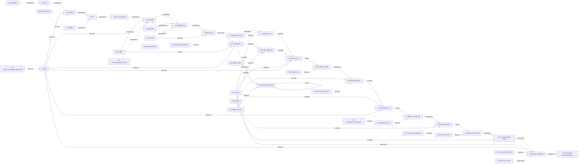

# 고정 팀 작업 흐름의 directed graph 분석

작성일: 2026-08-09 (Asia/Seoul)
범위: 설계 단계 전용 조사. 구현·팀 수 확정·조직 개편을 하지 않는다.

## 0. 한눈에 보는 결론

Doctori의 고정 팀은 일을 일곱 방으로 나누어 맡는다. 하지만 F01의 실제 흐름은
일곱 방이 동시에 달리는 그래프라기보다, **한 줄로 이어진 긴 줄**에 가깝다.
기획과 조사가 설계로 모이고, 설계 1팀과 설계 2팀이 한 번 합의한 뒤에야 구현이
시작된다. 구현 뒤에는 검증 1팀과 검증 2팀이 같은 것을 새 폴더에서 다시 확인하고,
문제가 나오면 구현으로 되돌아가 고친다. 이 구조는 느리지만, 실제 보안 결함을
세 번 찾았다.

문서에 기록된 F01 흐름의 수치는 다음과 같다.

| 항목 | 관찰된 값 | 뜻 |
| --- | ---: | --- |
| 고정 역할 | 7개 | 기획, 정보조사, 설계 1·2, 검증 1·2, 분석 |
| 승인까지의 주 경로 | 18개 작업·결정 checkpoint, 17개 의존 전이 | 설계 시작부터 Windows 최종 승인까지의 시간 순서. 노드 세는 방식은 부록에 고정했다. |
| 재작업 루프 | 5개 | 설계 1, 구현 3, 대시보드 1. 별도의 진행률 진단 루프 1개도 있었다. |
| 구현 뒤 신선한 독립 감사 | 최소 4회 | 각 감사는 새 폴더에서 `preflight → analyze → ingest → query → replay` 5단계 재실행 |
| 신선한 감사의 최소 단계 실행 | 20회 | 4회 × 5단계. 여기에 검증 1팀의 실행과 재확인이 더해진다. |
| 실제로 발견한 중요 결함 | 3개 | 고정 ELF 경로, AST 원본의 사용자 절대 경로 15,533건, junction을 통한 프로젝트 밖 쓰기 |
| 마지막 Windows 검증 | events 23줄, `replay_mismatch=0`, 절대경로 0건 | `F01_WINDOWS_FINAL_APPROVAL.md`의 최신 확인값. macOS에는 적용되지 않는다. |
| macOS 상태 | `deferred/unknown` | 실행 증거가 아직 없으므로 F01 전체 완료가 아니다. |

따라서 “고정 팀을 없애라” 또는 “그대로 유지하라” 중 하나를 지금 고르는 것은
근거가 부족하다. 현재 증거가 말하는 더 좁고 안전한 결론은 다음이다.

> 안전 검증의 독립성은 보존하되, 모든 작업을 영구적인 고정 역할에 묶지 말고,
> 작업 위험도와 변경된 경로에 따라 역할과 검증 edge를 켜고 끄는 동적 그래프를
> 실험할 가치가 있다.

## 1. 내부 문서를 읽는 방법

이 보고서는 다음 내부 문서를 근거로 했다.

- [`WORK_DURATION_ANALYSIS.md`](../evidence/doctori/WORK_DURATION_ANALYSIS.md): F01의 시간 순서, 세 번의 실제 보안 결함, 반복 재검증, 줄일 수 있었던 지연을 기록한다.
- [`PROCESS.md`](../../PROCESS.md): Android Kotlin/Java → JNI → C/C++ → Gradle/CMake → AAR/ELF → Evidence Ledger 범위와 현재 상태를 정한다.
- [`0003-two-model-mutual-oversight.md`](../evidence/doctori/decisions/0003-two-model-mutual-oversight.md): 같은 중요한 결과를 서로 다른 모델이 독립적으로 확인하도록 한다.
- [`0005-orchestrator-delegation-only.md`](../evidence/doctori/decisions/0005-orchestrator-delegation-only.md): 오케스트레이터는 조정·배정·결과 통합만 하며 저장소 파일을 직접 고치거나 테스트하지 않는다.
- [`F01_FINAL_CROSS_MODEL_ACCEPTANCE.md`](../evidence/doctori/verification/F01_FINAL_CROSS_MODEL_ACCEPTANCE.md): 수정 전 마지막 교차 확인에서 경계 검사 지연과 AST 절대경로 누출을 `REVISE`로 기록한다.
- [`F01_WINDOWS_FINAL_APPROVAL.md`](../evidence/doctori/verification/F01_WINDOWS_FINAL_APPROVAL.md): 경계·junction 수정 뒤 최신 Windows 승인과 남은 macOS 범위를 기록한다.
- [`F01_JUNCTION_TEAM2_REAUDIT.md`](../evidence/doctori/verification/F01_JUNCTION_TEAM2_REAUDIT.md): 파일 생성 전 junction 공격을 재현하고 수정 뒤 차단했음을 기록한다.

문서에 나온 “현재”와 “과거 REVISE”는 구별했다. 예를 들어 교차 승인 문서는
수정 전 `REVISE`이고, 최종 승인 문서는 그 문제를 고친 뒤 Windows에 한정한
`APPROVE`다. 두 문서를 동시에 읽고 모순이라고 세지 않았다.

## 2. 역할·작업·검증·결정·문서 노드

### 2.1 역할 노드

| ID | 역할 | 실제 책임 |
| --- | --- | --- |
| R-P | 기획 | 목표, 순서, 작업 배정, 상태 통합 |
| R-I | 정보조사 | 도구·라이선스·위험 가정 조사, 근거 제공 |
| R-D1 | 설계 1팀 | F01 설계와 이후 구현/수정 결과 작성 |
| R-D2 | 설계 2팀 | 설계 문서의 독립 감사와 설계 승인 |
| R-V1 | 검증 1팀 | Windows gate, 교차 비교, 최종 승인 |
| R-V2 | 검증 2팀 | 새 폴더·새 실행·공격 시나리오로 독립 재감사 |
| R-A | 분석 | 작업 시간·반복·지연·프로세스 결과를 사후 분석 |

R-P는 ADR 0005에 따라 파일을 직접 바꾸지 않는 조정 노드다. R-D1·R-D2와
R-V1·R-V2는 같은 일을 나누어 하는 생산팀이 아니라 **작성자와 독립 관찰자**의
쌍이다.

### 2.2 작업·검증·결정 노드

| ID | 종류 | 노드 |
| --- | --- | --- |
| T0 | 작업 | 제품 목표·범위·clean-room 규칙 정하기 |
| T1 | 작업 | 필요한 도구·라이선스·위험 조사 |
| T2 | 작업 | Evidence Core·Android Bridge 방식 설계 |
| T3 | 작업 | F01 구현 계획서 작성 |
| V0 | 검증 | 설계 2팀 독립 감사: `REVISE` |
| C0 | 결정 | 설계 1팀 수정 후 설계 2팀 `PASS` |
| T4 | 작업 | Gradle 모듈·Kotlin 분석기·Android fixture 구현 |
| V1 | 검증 | 검증 1팀 Windows current gate |
| V2 | 검증 | 검증 2팀 새 폴더 전체 재실행 감사 |
| C1 | 결정 | 교차 비교 `REVISE #1`: 고정 ELF 경로 등 |
| T5 | 작업 | `elfLocatorPath()`·`.gitignore` 수정 |
| V3 | 검증 | 검증 2팀 수정 후 새 폴더 재감사 `PASS` |
| C2 | 결정 | 교차 비교 `REVISE #2`: 늦은 경계 검사·AST 15,533건 |
| T6 | 작업 | `PathBoundary` 공통 관문·`AstPathNormalizer` 수정 |
| V4 | 검증 | 검증 2팀 junction 공격 재현: `REVISE #3` |
| T7 | 작업 | `ast`·`blobs/sha256`까지 파일 생성 전 경계 검사 |
| V5 | 검증 | 검증 2팀 두 외부 폴더 재감사 `PASS` |
| C3 | 결정 | 검증 1팀 Windows current gate `APPROVE` |
| T8 | 작업/대기 | 회사 MacBook 또는 macOS CI에서 별도 gate 실행 |
| B0 | 작업 | Dashboard v3 시각 검수와 571px 잘림 수정 |
| B1 | 조사 | 진행률 70% 정지로 보인 현상 4개 가설 진단 |

T8은 C3에 의존하지만 macOS 실행 환경이 없어 막힌 노드다. “실패”가 아니라
“실행 증거 없음”이다.

### 2.3 문서·결과 노드

| ID | 문서/결과 | 생성 또는 관찰 시점 |
| --- | --- | --- |
| D0 | `PROCESS.md` | 전체 절차, 상태 규칙, 역할 쌍 |
| D1 | `WORK_DURATION_ANALYSIS.md` | F01 시간·반복·비용 사후 분석 |
| D2 | ADR 0003 | 두 모델 상호감시 결정 |
| D3 | ADR 0005 | 오케스트레이터 delegation-only 결정 |
| D4 | `F01_IMPLEMENTATION.md` | F01 구현 설계 |
| D5 | `F01_IMPLEMENTATION_REVIEW.md` | 설계 감사 `REVISE` |
| D6 | `F01_IMPLEMENTATION_ACCEPTANCE.md` | 설계 수정본 `PASS` |
| D7 | `F01_WINDOWS_GATE.md` | 검증 1팀 최초 Windows gate |
| D8 | `F01_IMPLEMENTATION_TEAM2_AUDIT.md` | 검증 2팀 최초 독립 감사 |
| D9 | `F01_REVISE_FIX_REPORT.md` | 첫 구현 수정 B 결과 |
| D10 | `F01_REVISE_TEAM2_AUDIT.md` | B 수정 재감사 |
| D11 | `F01_FINAL_CROSS_MODEL_ACCEPTANCE.md` | C 수정 전 교차 `REVISE` |
| D12 | `F01_BOUNDARY_FIX_REPORT.md` | 경계·경로 정규화 수정 |
| D13 | `F01_JUNCTION_TEAM2_REAUDIT.md` | junction 재감사 |
| D14 | `F01_JUNCTION_FIX_REPORT.md` | junction 수정 결과 |
| D15 | `F01_WINDOWS_FINAL_APPROVAL.md` | 최신 Windows 승인 |
| D16 | `STATUS_SYNC_REPORT.md`·Dashboard 상태 | 문서·상태 동기화 |

### 2.4 Mermaid graph

화살표 라벨은 `dependency`(앞 노드가 끝나야 뒤 노드가 시작), `oversight`(독립
관찰), `rework`(수정으로 되돌아감), `blocked-by`(외부 조건이 막음), `observes`
(`분석`이 흐름을 읽음)이다. 이 그림은 작업 흐름을 읽기 위한 압축판이며, 각
문서 노드는 위 표의 결과물과 연결된다.



그림에서 `V1 → C1 ← V2`는 첫 fan-in이다. 한 팀의 “성공”만으로는 통과하지
않고, 작성 실행과 독립 재실행 결과가 합쳐져야 한다. `C1/C2/V4`에서 수정으로
돌아가는 화살표는 일반적인 DAG가 아니라 **피드백 edge가 있는 directed graph**임을
보여 준다. 구현·빌드 산출물 자체는 DAG로 볼 수 있지만, 사람과 검증의 운영
그래프는 cycle을 가진다.

## 3. 수치 분석

### 3.1 Critical path와 깊은 의존성

문서 타임라인에서 설계 작성부터 Windows 최종 승인까지의 주 경로를 다음 18개
checkpoint로 세었다.

`T0 목표 → T1 조사 → T2 증거 설계 → T3 계획 → V0 감사 → C0 PASS → T4 구현 → V1 gate → V2 독립 감사 → C1 REVISE → T5 수정 → V3 재감사 → C2 REVISE → T6 수정 → V4 junction 감사 → T7 수정 → V5 재감사 → C3 APPROVE`

이는 시간 순서의 **노드 수 18, 전이 수 17**이다. 실제 시간(분·시간)은
원문에 전부 기록되지 않았으므로 이 숫자를 wall-clock 시간으로 바꾸지 않는다.
macOS T8은 C3 뒤의 다음 gate지만 실행 환경이 없어서 critical path가 끝나지
않은 상태다.

기술 내부의 깊은 chain도 6층이다.

`Kotlin/Java → JNI → C/C++ → Gradle/CMake → AAR/ELF → Evidence Ledger`

이 chain 중 하나라도 틀리면 최종 증거가 흔들린다. 예를 들어 F01에서 고정 ELF
경로 문제는 코드가 실행되었다는 사실과 증거 파일이 가리키는 위치가 다를 수
있다는 문제였다. Bazel 공식 문서가 설명하듯 build dependency graph는 target의
directed acyclic graph이고, 실제 의존성과 선언한 의존성이 어긋나면 지금은 빌드가
되더라도 나중에 깨질 수 있다. F01의 운영 graph도 이 원칙을 따른다. “파일 생성
경로”가 명시된 edge 밖에 있으면 검증이 놓친다.

### 3.2 Fan-out과 fan-in

| 위치 | 구조 | 관찰된 영향 |
| --- | --- | --- |
| T3 F01 계획 | 설계 감사·구현·검증의 공통 입력 | 설계 문서의 모듈명 `analyzer`/`:doctori-analyzer` 불일치가 뒤 단계로 전달될 수 있었다. |
| T4 구현 결과 | 검증 1팀과 검증 2팀으로 fan-out | 두 팀이 같은 5단계 흐름을 별도로 실행해 독립성이 생겼지만 비용도 복제됐다. |
| V1, V2 → C1 | 두 검증 결과의 fan-in | 고정 ELF 경로와 `.cxx` 누락이 교차 비교에서 드러났다. |
| V3 → C2 | 재감사 결과와 원래 결과의 fan-in | AST 원본 15,533건 절대경로와 늦은 경계 검사가 드러났다. |
| V4 → T7 → V5 | 공격·수정·재공격 | junction처럼 “프로그램이 스스로 만드는 하위 폴더”가 누락될 수 있음을 확인했다. |
| T4 → B0 → B1 | F01 외부의 병행 fan-out | Dashboard 잘림과 진행률 진단이 주 경로의 WIP를 늘렸다. |
| C3 → T8 | 단일 후속 gate | Windows 승인만으로 macOS 승인까지 갈 수 없고, macOS 실행 환경이 병목이다. |

수치로 말하면 F01의 구현 결과는 최소 **두 독립 검증 lane**으로 복제되고,
최종 승인은 두 lane과 수정 결과가 다시 합쳐지는 fan-in이다. 이 중복은 단순한
낭비가 아니다. 첫 `REVISE`는 이전 고정 경로, 두 번째는 절대경로 누출과 경계 검사,
세 번째는 junction 공격이라는 서로 다른 결함을 찾았다.

### 3.3 Cycle과 재작업

명시적인 rework cycle은 다음 네 가지다.

1. 설계 2팀 `REVISE` → 설계 1팀 수정 → 설계 2팀 `PASS`.
2. 구현 후 첫 교차 `REVISE #1` → `elfLocatorPath()`·`.cxx` 수정 → 재감사.
3. 교차 `REVISE #2` → `PathBoundary`·`AstPathNormalizer` 수정 → junction 감사.
4. junction `REVISE #3` → 모든 하위 폴더를 생성 전 검사 → 두 외부 폴더 재감사.

병행 흐름에는 Dashboard REVISE cycle이 하나 더 있어, 문서가 말하는 전체
재작업은 **5개**다. 진행률 70% 진단은 수정 cycle이라기보다 “가설 4개를
재현·배제한 관찰 cycle”이다. 따라서 “전체 6번 loop”를 기술 결함 수정 6번으로
잘못 세면 안 된다.

### 3.4 Queue/WIP와 blocked 상태

Little의 법칙은 평균 WIP `L`, 처리율 `λ`, 평균 소요시간 `W` 사이에
`L = λW`가 성립한다는 것이다. [Little의 원 논문](https://pubsonline.informs.org/doi/10.1287/opre.9.3.383)과
[MIT 강의 자료](https://dspace.mit.edu/bitstream/handle/1721.1/91482/1-203j-fall-2004/contents/lecture-notes/qlec1.pdf)는
이 정의와 정상상태 가정을 설명한다.

Doctori 문서에는 작업별 시작·종료 시각과 도착률이 없으므로 실제 `λ`, `W`,
평균 `L`을 계산할 수 없다. 대신 관찰 가능한 구조는 다음과 같다.

- **역할 WIP 상한:** 고정 역할 7개가 동시에 일할 수 있는 슬롯은 7개다. 이것은
  실제 동시 실행 수가 아니라 조직상 상한이다.
- **관찰된 병행 WIP:** F01 주 경로와 Dashboard/운영 진단이 병행되었으므로
  최소 2개 작업 흐름은 동시에 존재했다. 정확한 최대 WIP는 미측정이다.
- **문서로 확인된 대기:** 설계 2팀은 설계 1팀 결과 뒤에야 감사할 수 있고,
  구현은 설계 `PASS` 뒤에야 시작하며, 최종 승인은 독립 재감사 뒤에야 가능하다.
  macOS gate는 실행 호스트가 없어 계속 대기한다.
- **병목:** R-V1의 final approval, R-V2의 신선한 재감사, macOS 실행 환경은
  다음 edge를 풀어 주는 단일 대기열이다.

향후에는 각 노드에 `arrivedAt`, `startedAt`, `finishedAt`, `blockedBy`,
`reworkOf`를 기록해야 Little의 법칙을 실제 데이터에 적용할 수 있다. WIP를
먼저 줄이고 검증을 없애는 식의 결론은 현재 데이터로는 정당화되지 않는다.

### 3.5 중복 검증 비용

문서에 명시된 독립 감사는 적어도 네 번이다. 최초 새 폴더 감사, `elfLocatorPath`
수정 뒤 감사, 경계 수정 뒤 junction 공격 감사, junction 수정 뒤 두 외부 폴더
재감사다. 매 감사는 다음 다섯 단계를 새 폴더에서 실행했다.

`preflight → analyze → ingest → query → replay`

따라서 독립 감사만 **최소 4 × 5 = 20단계 실행**이다. 매 수정 뒤 AAR 재빌드,
`--rerun-tasks`, SHA-256·행 수·바이트 동일성 대조도 붙었다. 이 비용은 “같은
문서를 두 번 읽는 비용”이 아니다. V2는 V1이 지나간 결과를 믿지 않고, 새 폴더에서
실제 공격까지 했다.

반대로 줄일 수 있었던 중복도 있다.

- 초기 설계 이름 불일치와 ADR 0006 인용 누락은 감사 전에 자동 이름 검사를 했다면
  막을 수 있었다.
- NDK 설치 누락과 SQLite 문법 실수는 구현 전 preflight로 막을 수 있었다.
- 실제 절대경로가 문서 6곳에 남아 나중에 정리해야 했다.

그러므로 비용을 “독립 검증 전부”로 몰아붙이면 안 된다. F01 증거상 안전성
결함을 잡은 검증은 유지 대상이고, 준비 부족으로 생긴 재작업은 선행 검사로 줄일
대상이다.

### 3.6 정보 지연과 stale edge

정보가 늦게 도착한 실제 사례는 네 종류다.

1. 설계 문서의 폴더 이름과 Gradle 실행 모듈 이름이 달라 구현 단계에서야 위험이
   보였다.
2. 초기 검증은 성공했지만, 새 실행 폴더에서 ELF 주소가 늘 `build/f01`을 가리킨다는
   사실이 교차 확인 때 드러났다.
3. AST 원본에는 사용자 절대경로가 15,533번 있었고, 정상화 전까지 게시 안전성의
   진실이 늦게 도착했다.
4. `ast/`, `blobs/sha256/`는 프로그램이 스스로 만드는 폴더라 경계 목록에서
   빠졌고, junction 공격에서야 실제 탈출이 관찰됐다.

추가로 절대경로 정리가 **6개 문서**에 필요했고, Dashboard의 571px 잘림은
기능 문제가 아니어도 검증 loop를 만들었다. 이 사례들은 정보가 중앙 문서에
늦게 모일수록 downstream edge가 이미 실행된 뒤에야 수정된다는 증거다.

### 3.7 Single point of failure

| SPOF 후보 | 수치/증거 | 완화 판단에 필요한 관찰 |
| --- | --- | --- |
| R-V1 최종 승인 | Windows gate를 `APPROVE`로 닫는 단일 결정 노드 | 다른 gate 담당자가 없어도 동일한 증거 정책을 재현할 수 있는가 |
| R-V2 독립 감사 | 모든 fresh audit과 공격 재현이 한 역할에 집중 | 감사 규칙·공격 fixture가 역할 밖 문서로 실행 가능한가 |
| 오케스트레이터 R-P | ADR 0005에서 배정·진행·결과 통합의 중심 | 오케스트레이터가 멈춰도 작업 상태·결과가 유실되지 않는가 |
| macOS 실행 호스트 | 현재 `deferred/unknown`의 직접 원인 | macOS CI 또는 회사 MacBook을 독립적으로 예약·재현할 수 있는가 |
| 공통 상태 문서/대시보드 | `PROCESS.md`, `PROGRESS.md`, `process.json` 동기화 필요 | 상태가 한 번만 선언되고 다른 표현이 자동 생성되는가 |

SPOF는 “사람을 더 넣자”는 뜻이 아니다. Brooks가 [원문에서 설명한
법칙](https://www.cs.cmu.edu/~15712/papers/mythicalmanmonth00fred.pdf)처럼 늦은
소프트웨어 일에 사람을 더 넣으면 교육·통신 경로가 늘어 더 늦어질 수 있다.
여기서는 역할을 늘리는 대신, 승인 규칙과 증거 저장을 어떤 한 사람이나 한
오케스트레이터에 의존하지 않게 만드는 것이 먼저다.

## 4. 외부 원문으로 보는 해석

### 4.1 Team Topologies: 영구 팀보다 흐름과 상호작용

[Team Topologies 공식 설명](https://teamtopologies.com/key-concepts)은
stream-aligned, enabling, complicated-subsystem, platform의 네 가지 팀 유형과
collaboration, X-as-a-Service, facilitation의 세 상호작용 방식을 제시한다.
또한 stream-aligned 팀은 고객 가치의 흐름을 처음부터 끝까지 소유하고, 팀 관계는
목표에 따라 바뀌는 snapshot이라고 설명한다.

Doctori에 대입하면 다음과 같다.

- 기획·정보조사는 stream-aligned 작업의 입력을 정리하는 enabling에 가깝다.
- JNI/Clang/ELF처럼 전문성이 높은 부분은 일시적 complicated-subsystem 또는
  platform 서비스로 볼 수 있다.
- 검증 2팀은 영구적인 “뒤늦은 hand-off”라기보다, 고위험 경로에서 facilitation
  또는 독립 oversight를 제공하는 edge가 될 수 있다.
- 현재 고정 구조는 실제로 여러 단계의 hand-off를 만들고 있다. Team Topologies
  공식 원칙의 “흐름에 집중”과 “관계는 계속 변한다”에 비추면, 역할 이름보다
  hand-off와 대기 edge를 줄이는 것이 설계 질문이다.

이 원칙은 고정 팀을 즉시 해체하라는 처방이 아니다. F01처럼 서로 다른 실행이
필요한 안전 edge는 유지하되, 매 작업마다 일곱 역할을 모두 통과해야 하는지는
별도 실험으로 판단해야 한다.

### 4.2 Conway: 팀 통신 그래프가 결과 그래프가 된다

[Conway의 1968년 원문](https://www.melconway.com/Home/Committees_Paper.html)은
시스템을 설계하는 조직이 그 조직의 communication structure를 닮은 설계를
만들게 된다고 관찰한다. F01은 실제로 “설계 1 → 설계 2 → 구현 → 검증 1·2 →
교차 승인” 모양을 문서와 증거 저장 구조에 새겼다.

장점은 책임과 독립성이 선명하다는 것이다. 단점은 Kotlin→JNI→C++→build→AAR/ELF
경계마다 담당자와 문서 경계가 생겨, 누락된 `ast`·`blobs` 경로처럼 시스템의
실제 edge가 조직 graph에 표현되지 않을 수 있다는 것이다. 즉 Conway 관점의
개선 질문은 “누가 누구를 감시하나?”뿐 아니라 “실제 파일 생성·증거 흐름을 만든
사람 edge가 graph에 모두 나타났나?”다.

### 4.3 Brooks: 사람 수보다 통신 경로와 준비도

Brooks의 고전은 늦은 프로젝트에 사람을 추가하는 것이 오히려 늦출 수 있음을
설명한다. F01에서 일곱 고정 역할을 더 잘게 쪼개면 독립성은 늘 수 있지만,
fan-in·문서 동기화·결정 통신이 늘 수 있다. 반대로 한 사람에게 다 맡기면
communication edge는 줄지만 독립 검증이 사라진다. 현재 증거는 이 두 극단 중
하나를 선택할 만큼 충분하지 않다.

### 4.4 Little: WIP를 줄이는 것과 검증을 줄이는 것은 다르다

`L = λW`는 WIP가 많거나 처리율이 낮으면 평균 흐름 시간이 길어진다는 간단한
경고다. 그러나 Doctori에는 wall-clock 로그가 없으므로 “검증 2팀을 없애면 W가
몇 % 줄어든다” 같은 숫자를 말할 수 없다. 먼저 queue event를 측정하고, 위험한
검증 edge와 단순 문서 consistency edge를 구분해야 한다.

### 4.5 DORA: 속도와 안정성을 함께 측정

[DORA 공식 지표 안내](https://dora.dev/guides/dora-metrics/)는 change lead time,
deployment frequency, failed deployment recovery time을 throughput으로, change
fail rate와 deployment rework rate를 instability로 둔다. 작은 변경이 더 빠르고
복구하기 쉽다는 원칙도 제시한다.

Doctori는 아직 production deployment 팀이 아니므로 DORA 등급을 계산할 수 없다.
대신 대응되는 내부 측정치를 설계할 수 있다.

- change lead time 대응값: `T3 계획 승인 → C3 승인`까지의 시간과 각 edge 대기시간.
- deployment frequency 대응값: F01/F02처럼 승인된 실험이 완료되는 빈도.
- change fail 대응값: 각 gate에서 `REVISE`로 되돌아간 비율.
- recovery 대응값: 결함 발견부터 재감사 `PASS`까지의 시간.
- rework rate 대응값: 새 기능보다 회귀·문서 수정 때문에 발생한 실행 수.

이것은 DORA를 그대로 적용한 값이 아니라 설계용 proxy다. F01에서는 REVISE가
실패만 뜻하지 않았다. 세 번은 실제 보안 문제를 찾아낸 좋은 feedback이었다.
따라서 “REVISE 0”을 목표로 하면 오히려 검증을 숨길 수 있다.

### 4.6 Build-system DAG: 선언하지 않은 edge가 위험하다

[Bazel 공식 문서](https://docs.bazel.build/versions/main/build-ref.html)는 target
graph를 DAG로 정의하고, actual dependencies가 declared dependencies의 하위
그래프여야 한다고 설명한다. 선언되지 않은 직접 의존성은 처음에는 동작해도
transitive dependency가 바뀌면 깨질 수 있다.

F01의 `ast`·`blobs/sha256` 누락은 이와 비슷하다. 프로그램이 실제로 쓰는 출력
경로는 경계 목록에 선언된 경로의 하위 집합이어야 하는데, 누락된 경로가 있어
junction으로 밖에 쓸 수 있었다. `PathBoundary`와 파일 쓰기 공통 함수는 코드에서
이 edge를 선언·집중시키는 방향이다.

### 4.7 Multi-agent software engineering: 역할 이름보다 통신 계약과 평가

[ChatDev 원 논문](https://arxiv.org/abs/2307.07924)은 설계·코딩·테스트를 서로
다른 agent 역할로 나누되, chat chain과 communicative dehallucination으로 무엇을
주고받을지 정한다. 자연어는 설계에, 프로그래밍 언어는 debugging에 도움이 된다는
관찰도 보고한다. 이는 F01의 역할 분리 자체를 증명하는 것은 아니지만, 역할을
만드는 것만으로 충분하지 않고 입력·출력·질문 계약이 필요하다는 근거가 된다.

[DeepMind의 scalable oversight 논문](https://arxiv.org/abs/2407.04622)은 debate,
consultancy, direct QA를 비교하며, 독립적인 상호 검토가 과제와 정보 비대칭에
따라 도움이 될 수 있지만 항상 같은 정도로 이기는 것은 아니라고 보고한다.
F01의 “두 모델”을 모든 작업에 기계적으로 적용하지 말고, 보안·재현성처럼
정보 비대칭과 높은 위험이 있는 edge에 집중해야 한다는 설계 근거다.

## 5. 구체적 대안: 아직 선택하지 않음

### 대안 A — 고정 팀 유지 + graph contract

일곱 역할을 유지하되, 각 edge에 다음 계약을 붙인다.

- 입력 문서, 출력 문서, 완료 조건, `blocked-by`, 재검증 범위를 명시한다.
- `REVISE`는 “실패”가 아니라 결함 분류(`security`, `reproducibility`, `docs`,
  `visual`)와 재검증 범위를 포함한다.
- V2는 모든 것을 무조건 처음부터 하지 않고, 변경된 경로의 영향 closure와
  공통 안전 회귀만 실행한다. 다만 보안 경계 변경은 전체 fresh run을 유지한다.
- `PROCESS.md`, `PROGRESS.md`, `process.json` 중 상태 원본을 하나로 정하고,
  나머지는 생성·검증 대상이 되게 한다.

장점은 F01에서 입증된 독립 oversight를 보존하는 것이다. 단점은 7개 역할과
handoff가 남아 WIP가 줄지 않을 수 있다. 이 대안은 “안전성을 유지하면서 문서·
재작업 비용을 줄일 수 있는가”를 검증하는 기준선이다.

### 대안 B — 작업별 동적 역할 graph

영구 팀 대신 각 작업의 위험·의존성으로 graph를 생성한다.

- 낮은 위험의 문서 consistency 작업은 기획/분석과 한 번의 자동 확인만 연결한다.
- JNI·AST·파일 경계처럼 높은 위험의 작업은 작성 역할, 독립 adversarial verifier,
  evidence steward, gate decision edge를 만든다.
- 역할은 “설계 2팀”처럼 영구 이름이 아니라 capability와 독립성 조건으로
  선택한다. 같은 모델·같은 context가 작성과 승인에 동시에 쓰이지 않게 한다.
- fan-out은 위험 항목으로 제한하고, fan-in decision은 증거 ID·실행 폴더·해시·
  환경을 모두 참조한다.

장점은 단순 작업에서 대기와 중복 검증을 줄일 가능성이다. 단점은 매번 graph를
만드는 오케스트레이션과 독립성 보장이 새 비용이 된다는 점이다. ChatDev류의
역할 분리는 참고일 뿐, Doctori의 보안 gate를 자동으로 보장하지 않는다.

### 대안 C — 하이브리드: 고정 roster + 동적 edge (검증할 우선 후보)

현재 roster와 ADR은 당장 바꾸지 않고, 실행 graph만 동적으로 만든다.

1. 기획·조사·분석은 상시 관찰 edge로 둔다.
2. 설계 1/2는 설계 변경이 있을 때만 활성화한다.
3. 검증 1/2는 위험 분류가 `security boundary`, `reproducibility`, `cross-model`
   인 경우에만 독립 fresh run으로 활성화한다.
4. 문서·시각 검수는 F01 기능 gate와 분리된 별도 lane으로 둔다.
5. macOS처럼 외부 환경이 필요한 gate는 “작업 대기열”과 “blocked 외부 자원”을
   서로 다른 상태로 기록한다.

이는 최종 팀 수를 정하지 않고도 A와 B의 차이를 비교할 수 있는 실험 형태다.
선택 여부는 다음 측정 뒤에 판단해야 한다.

| 판단 질문 | 필요한 증거 |
| --- | --- |
| 독립 검증을 줄여도 결함 탐지율이 유지되는가 | 동일 fixture에서 defect seeding, 탐지율, false negative |
| dynamic edge가 실제로 빨라지는가 | 노드별 대기·실행·재작업 시간, WIP, fresh-run 횟수 |
| 역할을 합쳐도 SPOF가 늘지 않는가 | 역할 부재 시 재개 가능성, 결정 재현성, 증거 완전성 |
| 보안 변경의 재검증 범위가 충분한가 | path boundary/junction/absolute path 공격 회귀 결과 |
| 문서 지연이 줄었는가 | stale document count, 동기화 오류, 여섯 문서 정리 재발 여부 |

## 6. 설계 단계에서 바로 기록할 데이터 계약

구현을 지금 하자는 뜻이 아니라, 다음 설계의 입력·출력 형식을 미리 합의하자는
뜻이다. 모든 graph edge는 아래 필드를 가져야 한다.

```text
edge_id
from_node
to_node
edge_type = dependency | oversight | rework | blocked-by | observes
artifact_ids
changed_scope
risk_class
arrived_at
started_at
finished_at
blocked_reason
rework_of
verification_depth = none | targeted | fresh-full
evidence = command, run_dir, hash, host_os, report
```

특히 `verification_depth`가 있어야 “검증을 줄였다”와 “같은 검증을 더 빨리
했다”를 구분할 수 있다. `host_os`를 항상 기록해야 Windows APPROVE와 macOS
deferred/unknown을 혼동하지 않는다. `rework_of`를 기록하면 cycle의 횟수와
재작업률을 추측하지 않고 계산할 수 있다.

## 기술 부록 A. 그래프 정의와 계산 규칙

### A.1 노드 종류

- 역할 노드: R-P, R-I, R-D1, R-D2, R-V1, R-V2, R-A (7개).
- 작업·검증·결정 노드: T0~T8, V0~V5, C0~C3, B0~B1 (21개). 이 중 T8은
  blocked 상태이고 B0/B1은 주 경로 밖 병행 lane이다.
- 문서·결과 노드: D0~D16 (17개).

따라서 이 보고서의 전체 모델은 **45개 노드**다. 주 critical path는 그중
역할·문서 노드가 아니라 작업·검증·결정 노드만 시간 순서로 세어 18개로
정의했다. 같은 문서가 여러 단계의 근거로 재사용되는 경우 문서 노드를 복제하지
않고 여러 `observes` edge를 둔다.

### A.2 edge 의미

| edge | 뜻 | 예 |
| --- | --- | --- |
| dependency | 뒤 노드가 앞 노드의 결과 없이는 시작할 수 없음 | C0 → T4 |
| oversight | 독립 역할이 같은 결과를 관찰·재실행 | V2 → C1 |
| rework | 판정이 이전 작업으로 되돌아감 | C2 → T6 |
| blocked-by | 외부 자원·조건이 시작을 막음 | C3 → T8 |
| observes | 분석·문서가 사실을 읽지만 실행 소유권은 없음 | R-A → C3 |

role → task ownership edge와 task → document output edge는 책임을 보여 주는
보조 edge다. 그것을 dependency로 세면 “사람이 담당한다”와 “선행 완료가 필요하다”
를 혼동하므로 critical path 수에 넣지 않았다.

### A.3 측정하지 않은 값

다음은 내부 문서만으로 정밀 계산할 수 없다.

- 각 task의 실제 분 단위 duration 및 대기시간
- 동시 WIP의 시계열과 도착률 `λ`
- role별 token·비용·재실행 시간
- 검증 누락으로 발견하지 못한 결함(false negative)
- 대안별 DORA 등급

이 값을 채우지 않은 채 “동적 그래프가 2배 빠르다” 또는 “고정 팀이 최적이다”라고
말하면 내부 증거보다 강한 주장이다.

## 기술 부록 B. 외부 참고 원문 목록

1. Matthew Skelton, Manuel Pais, **Team Topologies 공식 핵심 개념** — [4 team types, 3 interaction modes, flow와 continuous adaptation](https://teamtopologies.com/key-concepts).
2. Melvin E. Conway, **How Do Committees Invent?**, Datamation, 1968 — [저자 제공 원문](https://www.melconway.com/Home/Committees_Paper.html).
3. Frederick P. Brooks Jr., **The Mythical Man-Month** — [CMU가 제공하는 원문 PDF](https://www.cs.cmu.edu/~15712/papers/mythicalmanmonth00fred.pdf).
4. John D. C. Little, **A Proof for the Queuing Formula: L = λW**, Operations Research 9(3), 1961 — [INFORMS 원문 서지·초록·DOI](https://pubsonline.informs.org/doi/10.1287/opre.9.3.383).
5. MIT 1.203J, **Queueing Systems Lecture 1** — [Little’s Law 강의 PDF](https://dspace.mit.edu/bitstream/handle/1721.1/91482/1-203j-fall-2004/contents/lecture-notes/qlec1.pdf).
6. DORA, **DORA’s software delivery performance metrics** — [공식 지표 정의·해석](https://dora.dev/guides/dora-metrics/).
7. Bazel, **Concepts and terminology** — [target graph, DAG, actual/declared dependencies](https://docs.bazel.build/versions/main/build-ref.html).
8. Chen et al., **ChatDev: Communicative Agents for Software Development**, 2023 — [arXiv 원 논문](https://arxiv.org/abs/2307.07924).
9. Kenton et al. (Google DeepMind), **On scalable oversight with weak LLMs judging strong LLMs**, 2024 — [arXiv 원 논문](https://arxiv.org/abs/2407.04622).

이 목록은 외부 이론이 Doctori의 결과를 증명한다고 주장하는 목록이 아니다. 각
원문에서 얻은 설계 원칙을 F01의 관찰값과 대조하기 위한 근거 목록이다.
